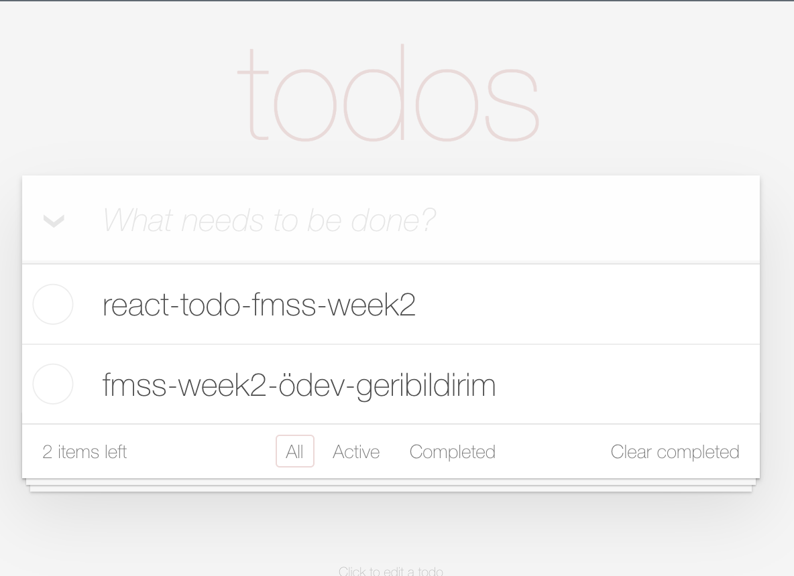
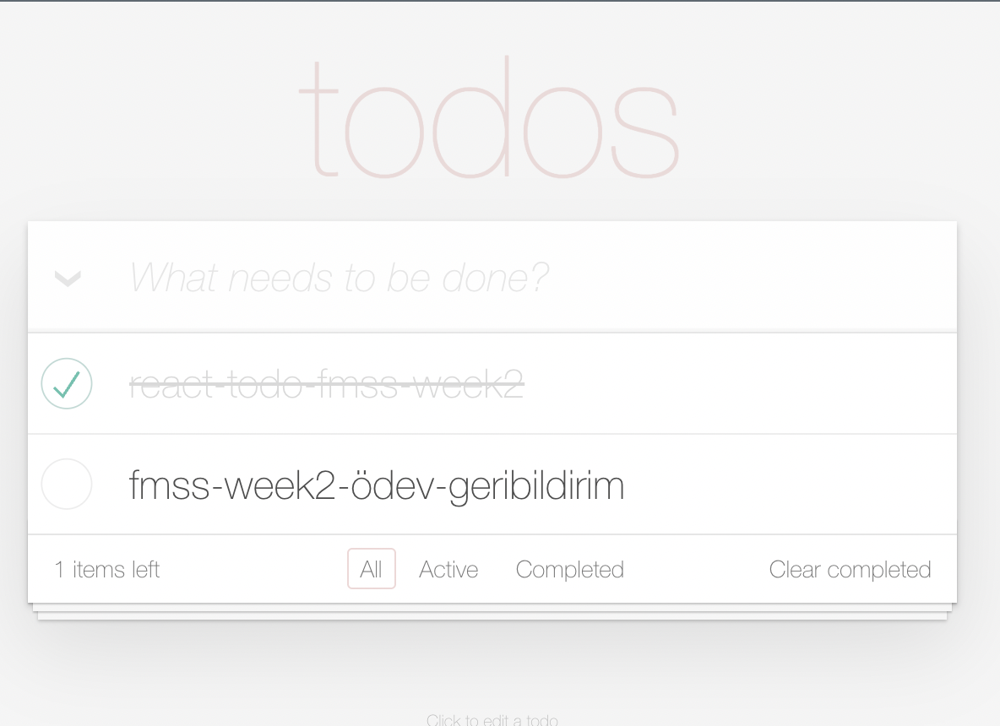
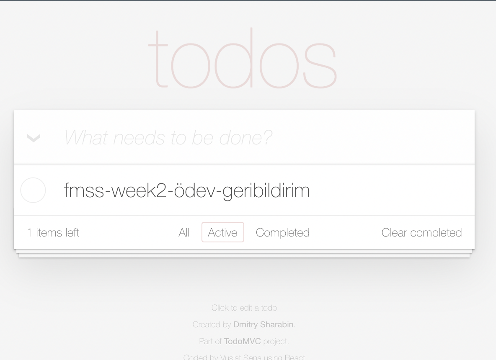
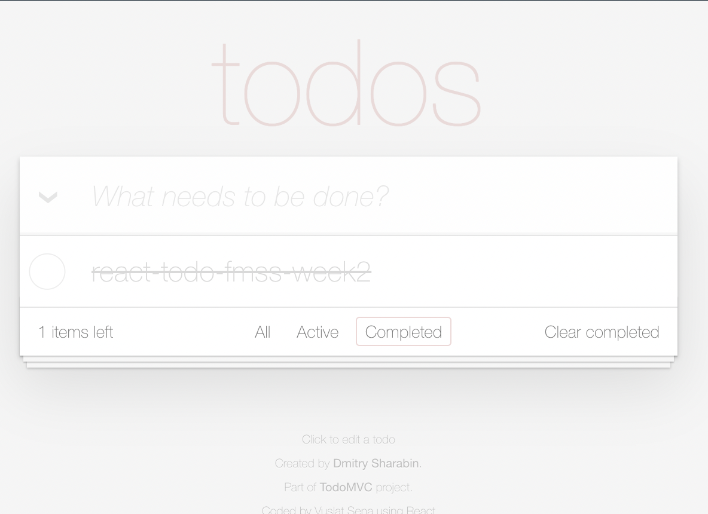

#  Week 2 Homework 2

Patika.dev &amp; FMSS Bilişim Front-end Practicum Week2 - Homework 2. This is a simple todo application built using React.

## Installation
1. Clone the repository
2. `npm install` command to install dependencies
3. `npm start` command to run the application
4. Open `http://localhost:3000` to view the application in the browser.

## Assignment Requirements
https://codepen.io/dmitrysharabin/pen/MWgQNYZ make the shared runtime run as a React app.

## Result

